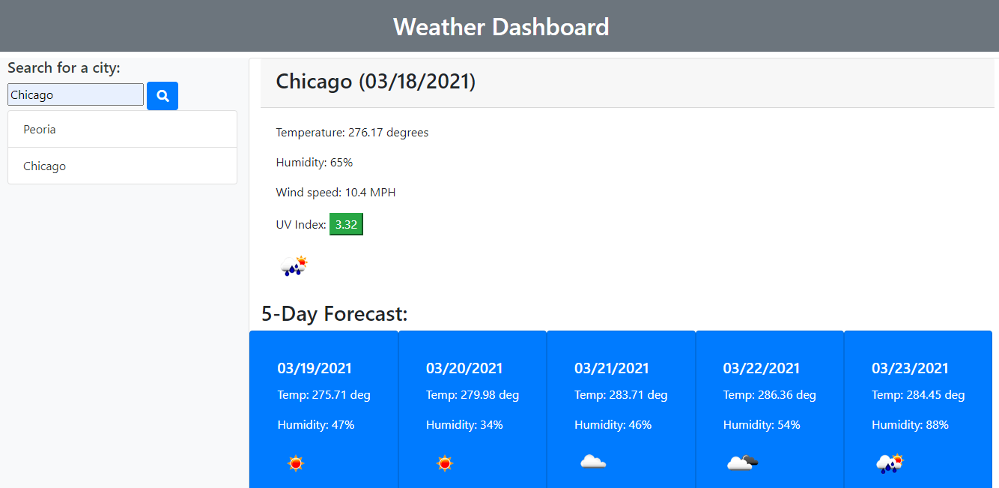

# Project title: Weather-Dashboard

## Description: This is a weather dashboard that allows the user to track weather for multiple locations. 

## Table of Contents
* [Instillation](#installation)
* [Usage](#usage)
* [Credits](#credits)
* [License](#license)

## Installation:

There are no steps to install. Please navigate to the deployed site using the link below.

# Usage: 

Navigate to the deployed page to view the site. Below is a snapshot of the site.

 

## License: 

None. 

## Credits: 

Katherine Lynn

## Github deployed page: 

[Github deployed page](https://klynn726.github.io/weather-dashboard/)

## Github repository: 

[Github repository](https://github.com/klynn726/weather-dashboard)
